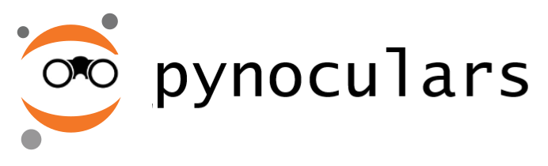
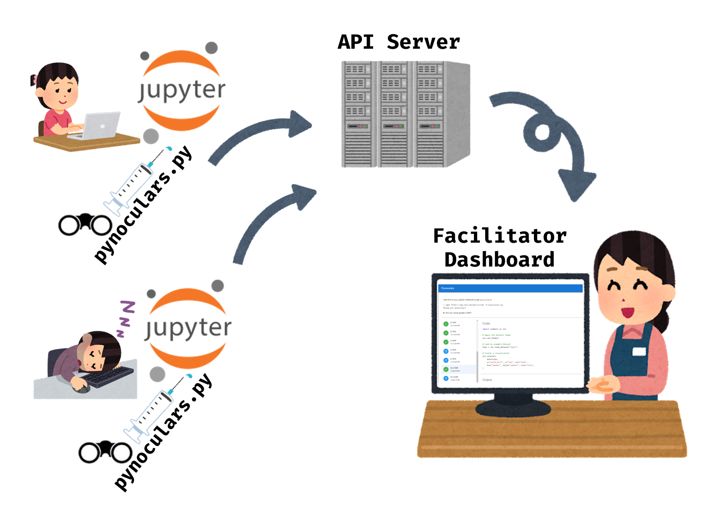

# Pynoculars

Submitted to Hack & Roll 2022 by team Flexbox (Lim Li, Likai, Jia Cheng and Si Yuan).

[Devpost](https://devpost.com/software/pynoculars)

## Inspiration
Teaching remote programming classes using Jupyter notebook worksheets is awesome. However, managing them can be a pain. It is almost impossible to know the exact progress of students, and communication (e.g. when debugging) is slow and imprecise. 

## What it does
_Look over people's shoulder and into their code, but online!_

_AKA requestbin/webhook.site for ipython_

Taking a Jupyter notebook file, our extension allows an instructor to view the progress of a group of students (live!) as they work. When a student runs a cell, the instructor can see:

* Raw output
* Code in the cell
* Stacktrace of any errors that occured

Try it out by first loading a IPython notebook over [Kaggle](https://www.kaggle.com/kernels/fork-version/84700985), [Colab](https://colab.research.google.com/drive/1w0fOthzCA6fs1y-kg5qkI3sAAM_DfIHN?usp=sharing) or even your local jupyterlab installation and install the `pynoculars.py` script. Run some code as if you were a student in a classroom, then take a look at the facilitator ~~[dashboard](https://eg.ress.me)~~ (now offline) and see if your "teacher" found out what you wrote!

## How we built it
We built the following components:

* An extension to IPython, hooking into its cell evaluation cycle.
* A server that receives student’s cell entry data from the IPython extension
* A React frontend that displays the info collected by the server

The extension involves significant monkeypatching and context management of IPython features. Much of it was created with reference to the [IPython `capture` magic](https://github.com/ipython/ipython/blob/master/IPython/utils/capture.py) and the [Jupyter matplotlib inline backend](https://github.com/ipython/matplotlib-inline/blob/master/matplotlib_inline/backend_inline.py).

_Clip art from [irasutoya](https://www.irasutoya.com/)_

## Challenges we ran into
* The ipynb format (<4.5) does not support unique cell IDs, at least such ID info is not readily available to extensions, even with lifecycle hooks. In fact the lifecycle hooks give very restrictive metadata like the *last* evaluation result, whereas we actually wanted all the output/evaluation results in a cell.
* IPython and Jupyter hook into many parts of the evaluation of a Python program, and make it difficult to obtain raw error stacktraces and outputs.

## Accomplishments that we're proud of
* Managed to “hack” IPython to allow us to capture the entire output and error stacktrace
* Implemented 3 distinct components to our tech stack in a short period of time

## What we learned
* IPython extensions and their many caveats
* Various tricks in Jupyter Notebook (e.g. locking cells)
* And a bit of React / Material UI

## What's next for Pynoculars
* Databases for persistent storage of data collected from the IPython extension, currently it is only stored in memory on the server.
* Making records downloadable on the frontend, conversion to csv format etc.
* A more organized display to show student activity
* An interface to generate and deploy worksheets and check answers

